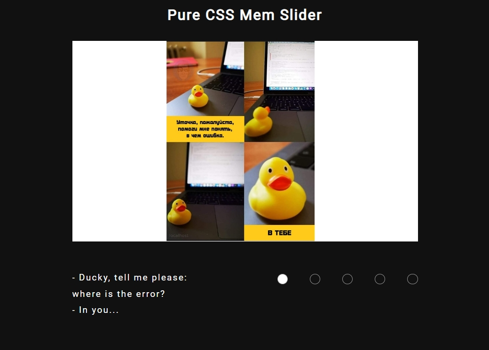

# App "CSS Mem Slider"

Deploy: [https://nata-kostina.github.io/cssMemSlider/](https://nata-kostina.github.io/cssMemSlider/ "App CSS Mem Slider")
***
## Description

The Mem Slider app is developed on pure CSS.

Features:

* no JS-framework
* no JS code
* pure CSS
* includes animation of scrolling

## Specification

[https://github.com/rolling-scopes-school/tasks/tree/master/tasks/css-meme-slider](https://github.com/rolling-scopes-school/tasks/tree/master/tasks/css-meme-slider "Spec")

## Screenshots

## Developed With
* HTML
* CSS
* IDE:  Visual Studio Code
* OS: Microsoft Windows 10